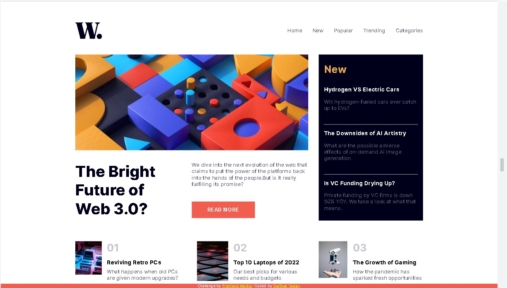
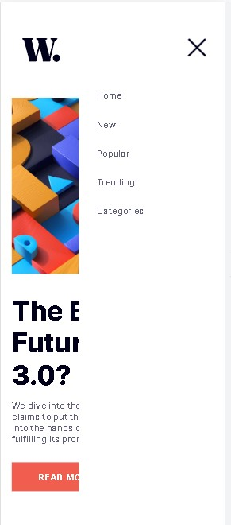

# Frontend Mentor - News homepage solution

This is a solution to the [News homepage challenge on Frontend Mentor](https://www.frontendmentor.io/challenges/news-homepage-H6SWTa1MFl). Frontend Mentor challenges help you improve your coding skills by building realistic projects. 

## Table of contents

- [Overview](#overview)
  - [The challenge](#the-challenge)
  - [Screenshot](#screenshot)
  - [Links](#links)
- [My process](#my-process)
  - [Built with](#built-with)
  - [What I learned](#what-i-learned)
  - [Useful resources](#useful-resources)
- [Author](#author)

## Overview

### The challenge

Users should be able to:

- View the optimal layout for the interface depending on their device's screen size
- See hover and focus states for all interactive elements on the page

### Screenshot






### Links

- Solution URL: [Add solution URL here](https://your-solution-url.com)
- Live Site URL: [Add live site URL here](https://your-live-site-url.com)

## My process

### Built with

- Semantic HTML5 markup
- CSS custom properties
- Flexbox
- Mobile-first workflow
- Custom icons and fonts
- [Styled Components](https://styled-components.com/) - For styles

### What I learned

Things and tricks that i have learned and used in this challenge are:
- Use of em,rem,percentage units

```css
.checkbtn{
    font-size: 2rem;
    cursor: pointer;
    line-height: 1.5em;
    display: none;
    z-index: 1;
}
```

- Changing images based on screen sizes using javascript

```javascript
function updateImageSource() {
    var image = document.getElementById("main-img");
    var isSmallScreen = window.matchMedia("(max-width: 675px)").matches;
    
    if (isSmallScreen) {
      image.src = "/assets/images/image-web-3-mobile.jpg";
    } else {
      image.src = "/assets/images/image-web-3-desktop.jpg";
    }
  }
  
  // Call the function initially and whenever the window is resized
  updateImageSource();
  window.addEventListener("resize", updateImageSource);
```
- Use of Transition property in css

```css
#list-frame{
    width: 65%;
    position: fixed;
    top:-2%;
    background-color: white;
    height: 100vh;
    right: -100%;
    text-align: left;
    transition: all .5s;
}
```
- Mobile first workflow for responsive design

- Creating Menubar for small screen sizes

### Useful resources

- [W3schools](https://www.w3schools.com) - This helped me in creating menubar using icons for small screen sizes.
- [Chatgpt](https://openai.com) - Helped me with changing of images when size of the screen changes and helped me with a lot of minor queries.

## Author

- Website - [Sarthak Yadav](https://www.linkedin.com/in/sarthak-yadav-51a708260/)
- Frontend Mentor - [@sarthakyadav25](https://www.frontendmentor.io/profile/sarthakyadav25)
- Twitter - [@sxrthxk](https://twitter.com/sxrthxk)
